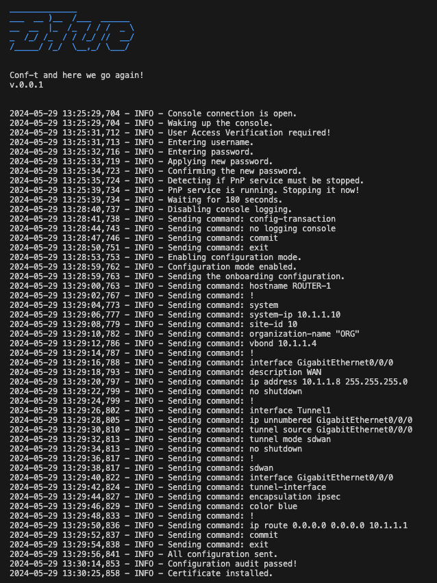

# Blue

## Introduction

Sometimes you are in a spot where you have to do repetitive tasks that are prone to error, you have only limited time or knowhow and the only tool you have at hand is the traditional Cisco's console port connection. Granted, it's not the best programming interface to say the least but it could be all you have. 

Blue takes an industrialized approach to device onboarding process (note: SDWAN at the moment) using an automation script over console port connection. The end goal is to bootstrap the device just enough so that it can be remotely management using more robust tools be it normal SSH or SDWAN's controllers or something totally different in the future. 

## Installation

Software requirements:
- Tested on Python 3.10.1
- Python packages based on requirements.txt

`````
pip install -r requirements.txt
`````

## The Mandatory Bit on Certificates

If you need to manually manage certs using openssl CLI commands this might come handy.

````
# Create CA private key and certificate
openssl req -x509 -newkey rsa:4096 -keyout ca.key -out ca.crt -days 3650 -nodes
````

The ca.crt file is the local root certificate in this case. And the one that needs to be installed on the SDWAN router that you're onboarding. In a complete environment should already have this certificate because it was needed when Manager and other controllers were installed. However, if you are running the code in isolation for testing purposes please go ahed and create the certificate. 

Upload the certificate to a USB stick and plug it in the router for the onboarding process.

## Power Up And Wait Until Boot Finishes

Plug in the console cable. Switch on the target device. Open a console session.

Wait until the device has powered on properly. You can monitor the process via your console cable. 

After the device has finished booting hit Enter to break the PnP process that keeps running unless someone intervenes by sending commands via console. 

## Using Blue

The static onboarding template is stored under templates folder. Modify the variables as seen fit. 

Device credentials are stored in credentials.py. Modify to match with your environment. 

Run the code. Blue takes in only one argument which is the COM port / serial device.

````
./blue.py -s /dev/tty.usbserial-142120
````

A succesful run should look something like this:



## Afterword

Always maximize whatever is available. Don't look for excuses why something can't be done instead find a solution to the problem. Blue stands as a statement for that. 

Conf-t and here we go again,

T-J

## Appendix: Manual Onboarding for IOS-XE SDWAN Router

Manual Onboarding of SDWAN Router.

### 1. Stop PnP Process

Stop the PnP process. Wait a moment until the the device has killed the process and is up and ready. 

```
pnpa service discovery stop
```

### 2. Configure System Settings

Configure the device with the matching system settings (org-name and vbond) and allocate its own identifiers. 

```
system
hostname ROUTER-1
system-ip 10.1.1.10
site-id 10
organization-name "ORG"
vbond 10.1.1.4
```

### 3. Create WAN Interface 

Configure an IP address to the WAN interface. 

```
interface GigabitEthernet0/0/1
description WAN
ip address 10.1.1.8 255.255.255.0
no shutdown
```

### 4. Create Tunnel Interface

Create the tunnel interface and tie it to the WAN interface.

```
interface Tunnel1
ip unnumbered GigabitEthernet0/0/1
tunnel source GigabitEthernet0/0/1
tunnel mode sdwan
no shutdown
```

Allocate TLOC color to the WAN interface used for the tunnel. 

```
sdwan
interface GigabitEthernet0/0/1
tunnel-interface
encapsulation ipsec
color blue
```

### 5. Add Default Route

Add a default route to enable connectivity to wider network (if needed). 

```
ip route 0.0.0.0 0.0.0.0 10.1.1.1
```

### 6. Commit Changes 

Save configuration by committing it.

```
commit
```

### 7. Install Root Certificate

Install root certificate. 

```
request platform software sdwan root-cert-chain install bootflash:root-ca-chain.pem
```

After completing Steps 1-7 the device can be confirmed from vManage dashboard. 
